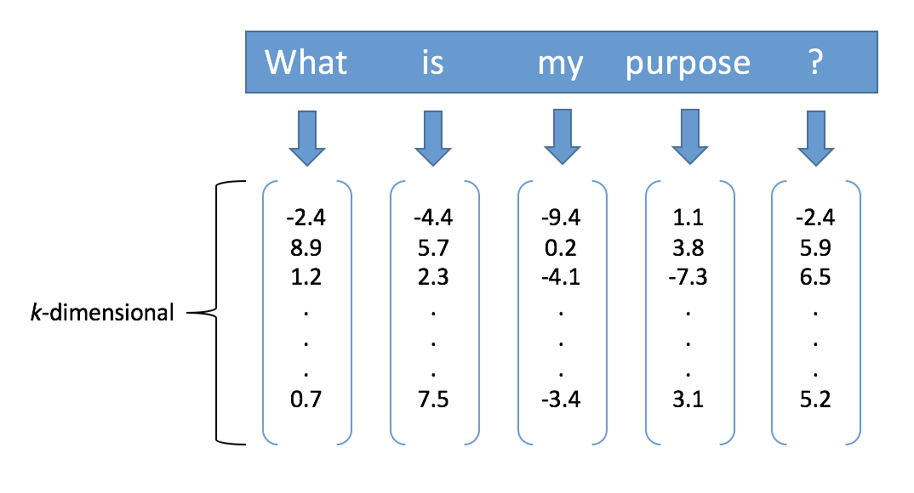

# Extending DeepER: A Closer Examination of Deep Learning for Entity Resolution
##### by Derek Zhao

## Abstract

The task of entity resolution (or deduplication) remains a challenging fundamental problem in data integration. Deep learning offers exciting paths forward in the pursuit of more accurate and more flexible entity resolution systems. We examine and evaluate two models, the Manhattan LSTM, originally designed for comparing the semantic similarities between short sentences, and DeepER, a neural network designed specifically for entity resolution. Both models leverage the success of distributed word embeddings in expressing semantic meaning. We additionally propose and evaluate various extensions to the DeepER framework and show in our experimental results that some extensions consistently offer improvements in model performance.

## Introduction

When processing structured data from disparate sources into a single unified source, it is often necessary to identify and remove duplicate records within a source or to perform some form of matching between records from separate sources that refer to the same entity. This task of entity resolution (or deduplication) remains a challenging fundamental problem in data integration. Because data is subject to inconsistencies in formatting and semantic meaning (ex. (George W. Bush, Republican Party) vs. (George Walker Bush, GOP)), identifying different records of the same entity is rarely straightforward. Recent advances in natural language processing and deep learning architectures led to the development of DeepER, a deep-learning-based entity resolution system, which we will examine more closely and extend in this project.

#### Machine Learning for Entity Resolution

The decades of attention invested in addressing the entity resolution task have culminated in a variety of machine-learning-based approaches where entity resolution is posed as a binary classification problem [1, 2, 3, 4]. Let _A_ and _B_ be two relational tables sharing the same _d_-attribute schema, _a ∈ A_ be a tuple from the first table, _b ∈ B_ be a tuple from the second table, and _s(a, b) ∈ ℝd_ be a **similarity vector**, a vector where each component is a similarity metric calculated from a pair of values, one form _a_ and one from _b_, both sharing the same attribute. Then given _A_, _B_, and a list of matching records, one can construct _|A| x |B|_ similarity vectors with corresponding labels, _0_ for a non-match and _1_ for a match [2]. These similarity vectors and labels can then serve as training data for a supervised machine learning algorithm, with random forests, support vector machines, and voting ensembles among the most commonly used.

One of the main challenges with such an approach is that, for text-based attributes, it is often not immediately clear which similarity metrics are most appropriate. Just to compare two strings, one has access to numerous character-based similarity measures (edit distance, affine gap distance, Smith-Waterman distance, Jaro distance metric, q-gram distance), token-based similarity measures (atomic strings, WHIRL, Jaccard similarity, q-grams with TFIDF), and phonetic similarity measures (Soundex, Oxford name compression, metaphone) [1]. Selecting the most appropriate similarity metric for each attribute requires expert domain knowledge and results in highly specialized entity resolution systems designed to only perform well on very specific datasets [5].

#### DeepER for Entity Resolution

To address these issues, Ebraheem et al. built DeepER [5], a more generalizable entity resolution system designed to require far less domain-specific expertise. Specifically, DeepER leverages a recent advance in the NLP community: **word vector embeddings** (also known as distributed representations), where a word can be expressed as a real-valued vector of arbitrary dimensionality that captures the semantic meaning of the word [6]. For example, two words (or more generally, tokens) that are semantically similar such as _Republican_ and _GOP_ are also represented by vector embeddings with high cosine similarity.

This notion of encoding the semantic meaning of words as vectors can be extended to sentences and entire documents. In the case of DeepER, recurrent neural networks are used to combine word embeddings into attribute embeddings, which can then be used to calculate similarities between the attributes of two tuples, as required for similarity vectors [5].

#### Project Goals

While DeepER performs well on many benchmark datasets, its behavior under a variety of conditions is not fully documented nor is its functionality complete. This project serves three different but related goals:

1. **Verify and explore**: We attempt to reproduce and verify the published performance results of DeepER on benchmark entity resolution datasets. Furthermore, we examine the robustness of the system to different text preprocessing methods.
2. **Extend functionality**: DeepER is currently only capable of handling text-based attributes. While it is theoretically possible to generate embeddings for numerical values, it is highly impractical. Furthermore, it is not uncommon for attributes to contain null values, which DeepER interprets as just another token. Thus, two natural extensions to DeepER involve providing support for numerical attributes and missing values. We also extend DeepER so that it can support multiple similarity metrics between two attribute values as well as multiple methods for composing word embeddings into attribute embeddings.
3. **Evaluate distance metric learning**: In **distance metric learning**, a model receives as input two objects and outputs a similarity score [7]. This is a popular and effective technique in the computer vision community, particularly for facial recognition [8], and we evaluate its efficacy in the context of entity resolution by exchanging images for tuples. We build and test a Siamese neural network model that directly learns the similarity between two records without the need to generate an intermediate distributed similarity vector [9].

#### Outline

The rest of this report is organized as follows:

- In Section 2, we provide a brief overview of key concepts underpinning DeepER's architecture as well as distance metric learning.
- In Section 3, we discuss in greater detail the extensions made to DeepER.
- In Section 4, we describe the experimental setup for testing the DeepER extensions.
- In Section 5, we present and analyze the results of said experiments.
- In Section 6, we conclude with some final remarks.}

## Background

In this section, we briefly overview some fundamental concepts as well as the DeepER system itself.

#### Word Embeddings

A word embedding procedure maps tokens into a latent vector space such that tokens with similar semantic meanings are closer together in the latent space than words with different semantic meanings [6]. Put differently, two semantically similar tokens such as _computer_ and _PC_ should have a high cosine similarity in the latent space. While there exists many different methods for creating such embeddings, with matrix factorization [10], skip-gram, and continuous-bag-of-words [6] among the most popular, they all share the fundamental assumption that a word's meaning can be defined by its context, the neighborhood of words that appear around it.

For example, because the words _senate_ and _congress_ are more frequently in the vicinity of neighboring words like _government_, _Washington_, and _political_ than a word like _fashion_, one could reasonably expect _senate_ and _congress_ to have more similar contexts than _senate_ and _fashion_. In fact, given a corpus with a vocabulary of size _v_, one could naively embed a word _w_ as a _v_-dimensional co-occurrence vector where each element counts the frequency with which a particular word appears in the neighborhood of _w_ throughout the corpus. Of course, such a method is impractical because _v_ is often much too large. 

One particular algorithm for embedding words into a latent space of more manageable dimensionality is GloVe [10] (short for _global vectors_), a matrix factorization technique. Given a corpus of documents, one can construct a co-occurrence matrix _X ∈ ℝv x v_ such that _Xij_ is the number of times word _wj_ appears within an arbitrary number of words _c_ of _wi_ throughout the corpus. At the simplest level, GloVe factorizes ln(_X_) into _W ∈ ℝ{v x k}_ and _H ∈ ℝk x v_, with row vector _Wi:_ corresponding to a _k_-dimensional embedding of word _wi_. The entire matrix _W_ can be used as the embedding layer of a neural network.

 Figure 1: Word embeddings 

For DeepER, Ebraheem et al. use a set of pre-trained 300-dimensional word embeddings generated from a Common Crawl corpus of 840 billion tokens \cite{ebraheem-deep-er}.

#### Neural Networks

Neural networks are considered universal approximators in that they are capable of approximating any bounded continuous function to an arbitrary degree of accuracy. It is a model that takes as input a vector, and applies to it a series of alternating matrix multiplications and element-wise non-linearities, collectively referred to as \textit{hidden layers}, to produce an output vector \cite{goodfellow-deep-learning}. 

Neural networks are trained via gradient descent; the error of the output vector is used to calculate the error gradient, which indicates how matrices of each hidden layer should be updated to minimize the error \cite{goodfellow-deep-learning}. In NLP, a network's first layer is often an embedding layer that expects as input a one-hot vector that essentially selects out the appropriate embedding for a particular word. As we will see later in the project, one can choose whether to fix the weights of the embedding layer, forcing gradient-based updates to be applied only to subsequent layers, or to make the weights of the embedding layer themselves trainable, allowing vector embeddings of words to be fine-tuned for the network's specific task \cite{collobert-natural}.

#### Long Short Term Memory

A recurrent neural network is one designed to model sequential dependencies in the data. Given a sequence of input vectors $x_1, x_2, ..., x_T$, an RNN expects as input not just $x_t$, but also its own output from the previous time step $o_{t-1}$ that was itself calculated from $x_{t-1}$ and $o_{t-2}$. In this way, an RNN's output accounts not only for the current input vector in the sequence, but all prior input vectors in the sequence \cite{mandic-recurrent}.

However, one crucial shortcoming of traditional RNN's is that they are unable to model long-term dependencies in sequential data (i.e. they are only able to look a few steps back at most). Long Short Term Memory networks \cite{hochreiter-long} were designed to address the long-term dependency problem by adding memory cells to the network that can, if necessary, carry information through time steps without any transformation or attenuation. The details of this memory mechanism is beyond the scope of this report, but LSTM's have been immensely successful in domains such as machine translation, text classification, and sentiment analysis. A notable extension to the LSTM is the bi-directional LSTM, or bi-LSTM, where a second LSTM is applied to the same sequence of data but starting from the end and moving towards the beginning, providing a different view of the data \cite{schuster-bidirectional}. The output of a bi-LSTM is simply a concatenation of the outputs of its two individual LSTM's.

\begin{figure}
    \includegraphics[scale=0.35]{../imgs/word-embeddings-lstm.png}
    \caption{\textbf{LSTM}}
    \label{fig:word-embeddings-lstm}
\end{figure}

#### Manhattan LSTM

While a typical neural network expects as input one object, be it a tuple, image, or document, networks designed for distance metric learning operate on pairs of objects, with the similarity of a given pair serving as the target output \cite{yang-distance}. A common architecture for distance metric learning is the Siamese network, which consists of two separate sister networks, one for each input and usually with identical architecture and weights, that are then joined at the output layer to produce a single distance or similarity measure for each pair of inputs. The general principal is that to produce accurate similarity measures, sister networks are required to embed inputs into a latent space such that two inputs that are similar are also close to each other in the latent space, not unlike word embeddings.

A particular instance of a Siamese architecture for scoring sentence similarities is the Manhattan LSTM (MaLSTM) \cite{mueller-siamese}, where the outputs of two LSTM's, $x \in \mathbb{R}^d$ and $y \in \mathbb{R}^d$, are joined via a similarity function based on the $l_1$ norm: $s(x, y) = e^{-\left\|x - y\right\|_1}$.

\begin{figure}
\includegraphics[scale=0.4]{../imgs/malstm-architecture.png}
    \caption{\textbf{MaLSTM}}
    \label{fig:malstm}
\end{figure}

By constraining the model to a simple $l_1$-based similarity, the LSTM's are required to fully capture the semantic differences between two pairs of sentences. The MaLSTM has been shown to work well on scoring sentence similarities, and we explore later whether its performance is transferable to text-based record tuples.

#### DeepER

DeepER is similar to MaLSTM in that it also uses two sister networks with identical architectures and weights, but it differs in that the outputs of both sister networks are not directly combined and mapped to a similarity measure. Rather, the outputs are combined into a distributed similarity vector, similar to most ML-based ER systems, and the remainder of the MaLSTM functions as a typical classifier, using densely connected hidden layers to map the similarity vector to a binary output for match or non-match \cite{ebraheem-deep-er}.

Because a tuple consists of multiple attributes, each consisting of multiple tokens, replacing each token with a word embedding would map an attribute to a matrix. In such a form, it is unclear how to compute the similarity between two attributes. Instead, DeepER uses word embeddings to compose an attribute into a vector, an attribute embedding.

Ebraheem et al. propose two methods for composing word embeddings into attribute embeddings. For each attribute, one can:
\begin{enumerate}
\item{Average all the $k$-dimensional word embedding vectors into a single $k$-dimensional vector.}
\item{Apply a shared LSTM to the sequence of $k$-dimensional word embedding vectors and output a $k'$-dimensional vector. Typically $k' < k$.}
\end{enumerate}

By shared LSTM, we mean that a single LSTM is responsible for composing all attributes into attribute embeddings as opposed to using a unique LSTM for each attribute that needs to be embedded.

If attribute embeddings are generated through an averaging composition, DeepER uses cosine similarity to map two $k$-dimensional vectors to a scalar value, which can then be concatenated with similarity measures from other attributes to form a distributed similarity vector. But if attribute embeddings are generated through an LSTM composition, DeepER instead calculates a $k'$-dimensional difference vector (an element-wise difference between the two attribute embeddings) and a $k'$-dimensional Hadamard product (en element-wise product between the two attribute embeddings) and concatenates the results into a vector, which is then concatenated with other similarity measures to form a distributed similarity vector.

Finally, a densely connected neural network maps the distributed similarity vector to a binary output, $1$ if the pair is predicted to be a match, and $0$ otherwise.

\begin{figure}
    \includegraphics[scale=0.33]{../imgs/deep-er-framework.png}
    \caption{\textbf{DeepER framework}}
    \label{fig:deep-er-framework}
\end{figure}

\begin{algorithm}
    \caption{DeepER - Identifying Matches and Non-matches}
    \begin{algorithmic}[1]
        \REQUIRE A dataset $\mathcal{D}$ consisting of $n$ pairs of tuples, $(t_{1}^{(i)}, t_{2}^{(i)})$ for $ t = 1, 2, ..., n$
        \ENSURE Return a label vector $y$ where $y[i] = \begin{cases} 1, \text{   if } (t_{1}^{(i)}, t_{2}^{(i)}) \text{ match} \\ 0, \text{   otherwise} \end{cases}$
        \FOR{each tuple $t \in \mathcal{D}$}
            \FOR{each attribute $A_j$ of $t$}
                \STATE Pre-process and tokenize $t[A_j]$
                \STATE Convert each token $w_l \in t[A_j]$ into a word embedding $e_l \in \mathbb{R}^k$ using pre-trained GloVe embeddings
                \STATE $t[v_j] = $ composed attribute embedding obtained from either averaging or applying an LSTM on all $e_l$ 
            \ENDFOR
        \ENDFOR
        \FOR{each tuple pair $(t_{1}^{(i)}, t_{2}^{(i)}) \in \mathcal{D}$}
            \FOR{each attribute $j$}
                \STATE $s_j = $ similarity between $t_1[v_j]$ and $t_2[v_j]$. Can be scalar or vector depending on compositional method used to generate $v_j$
            \ENDFOR
            \STATE concatenate all $s_j$ into single distributed similarity vector $s$
            \STATE Use densely connected trained neural network $\mathcal{N}$ to classify $s$ as $\mathcal{N}(s) = \begin{cases} 1, \text{   if } (t_{1}, t_{2}) \text{ match} \\ 0, \text{   otherwise} \end{cases}$
            \STATE $y[i] = \mathcal{N}(s)$
        \ENDFOR
        \RETURN $y$
    \end{algorithmic}
\end{algorithm}

## Extending DeepER

In this section, we describe how we adapt MaLSTM to entity resolution, as well as the extensions made to DeepER.

#### Adapting MaLSTM

To adapt a MaLSTM for entity resolution, we make a simple adjustment to the data. For each tuple, we tokenize its attributes and convert each token to a word embedding, and then concatenate all embeddings together, essentially removing all notion of attributes and creating a single embedded "sentence" constructed from each attribute. The intuition is that because MaLSTM's have been shown to perform well at identifying similar sentences despite variations in syntax and diction, one might reasonably expect that removing the demarcations of attributes within a tuple and converting the tuple to a sentence-like object should not significantly impact the MaLSTM's effectiveness.

As we shall see later, MaLSTM and distance metric learning in general does not perform particularly well for entity resolution, but for a different set of reasons.

#### Attribute Compositions

###### Inverse document frequency

Ebraheem et al. \cite{ebraheem-deep-er} showed that while DeepER generally performs better when attribute embeddings are composed using an LSTM rather than through simple averaging, the averaging method produces surprisingly competitive results, and in some cases, performs better than using an LSTM. This is significant because averaging word embeddings to compose an attribute embedding requires far less computational resources and time than doing so with an LSTM.

However, one potential weakness with pure averaging is that all tokens are treated equally when in actuality some may be more informative than others. A common practice in NLP is to down-weight tokens that appear in many documents and up-weight tokens that rarely appear using a weighting scheme called TF-IDF (short for term frequency inverse document frequency) \cite{ramos-using}. Because DeepER averages word embeddings to compose attribute embeddings, the frequency with which the same token is used within an attribute is already accounted for. If a token appears twice in an attribute, its word embedding is twice averaged into the attribute embedding. Therefore, we focus on down-weighting tokens by the number of tuples they appear in.

Let $w$ be a token. Then we calculate the inverse document frequency of $w$ to be $$idf(w) = \frac{1}{df(w)^{\frac{1}{\alpha}}}$$ where $df(w)$ is the number of tuples in which token $w$ is present in any attribute, and $\alpha$ is a smoothing hyperparameter that evens out the magnitude of the downweighting.

For $l = 1, 2, ..., L$, let $w_l \in A$ be a token of attribute $A$, and $v_l$ be the word embedding of $w_l$. Then $v$, the attribute embedding of $A$ is: $$v = \frac{\sum_{l=1}^L idf(w_l)v_l}{\sum_{l=1}^L idf(w_l)}$$

Given an attribute, we calculate $idf$ weights for each token present, then normalize the weights so they all sum to $1$. The embedding for the attribute is essentially a weighted average of word embeddings with inverse document frequencies as coefficients.

###### Compound Compositions

As previously mentioned, depending on the datasets involved, attribute embeddings derived from an averaging composition may perform better than those from an LSTM composition, and vice versa \cite{ebraheem-deep-er}. Those using DeepER would need to perform tests on their own data to determine which compositional approach is optimal. A natural next step for DeepER is to support both composition methods simultaneously to obviate the need to choose between averaging and LSTM's.

That is, given a pair of attributes, we can generate an average-based embedding for both as well as an LSTM-based embedding for both, a compound composition resulting in two similarity measures calculated per attribute pair. This can be further extended to include IDF-based embeddings, which would result in 3 similarity measures per attribute pair.

#### Multiple Similarity Metrics

Similar to the notion of supporting multiple methods for composing an attribute embedding, we may also extend DeepER to support multiple similarity measures per pair of embedded attributes. In the current implementation of DeepER, pairs of attribute embeddings derived through averaging are evaluated using the cosine similarity while pairs of attribute embeddings derived through LSTM's are converted into difference and product vectors (Hadamard product) which are concatenated to the distributed similarity vector \cite{ebraheem-deep-er}.

If a cosine similarity suffices to achieve competitive performance on average-based attribute embeddings, they may also be useful when applied to LSTM-based attribute embeddings as an additional metric in combination with the difference and product vectors. We also extend DeepER to support the $l_1$-based similarity metric used by MaLSTM's, where for two $k$-dimensional vectors $x$ and $y$: $$s(x, y) = e^{-\left\|x - y\right\|_1}$$ This similarity measure can be applied to any attribute embedding pair in addition to other similarities and regardless of the embedding pair's compositional method.

We originally considered an $l_2$ based similarity measure commonly used for computing Gaussian kernels $$s(x, y) = e^{-\left\|x - y\right\|_2^2}$$ However, prior studies reported that this causes vanishing gradients, rendering networks untrainable \cite{chopra-learning}. In initial tests, we observed this to be the case as well, even when the $l_2$ similarity was one among many being concatenated to the distributed similarity vector.

We also considered converting pairs of average-based attribute embeddings into difference and product vectors but decided against doing so because the dimensionality of the embeddings can often be much too large (300-dimensional, for example) and result in an explosion of the dimensionality of the distributed similarity vector, especially if a tuple contains multiple text-based attributes.

#### Supporting Numerical Attributes

One crucial functionality that DeepER does not support is the integration of numerical attributes when classifying tuple pairs. In its current form, the only available method of incorporating numerical data into DeepER is to convert them into strings. However, this is clearly not optimal as the semantic difference between "7" and "8" may not necessarily be the semantic meaning of "1".

For DeepER to support numerical data, we need only specify a similarity measure for comparing a pair of scalar numerical attributes such that two scalars with a difference of $0$ maps to a similarity of $1$ while two scalars with increasingly larger differences maps to similarities closer to $0$. We propose the following for two scalars $a$ and $b$:
\begin{itemize}
\item{\textbf{Unscaled Gaussian}:  $s(a, b) = e^{-|a-b|}$}
\item{\textbf{Scaled Gaussian}:  $s(a, b) = e^{-\frac{2|a-b|}{a+b}}$}
\item{\textbf{Min-max ratio}:  $s(a, b) = \frac{\min(a,b)}{\max(a,b)}$}
\end{itemize}
It should be noted that the above similarity measures assume the numerical data is non-negative, which will be the case in all experiments. If $a = b = 0$, then the scaled Gaussian and min-max ratio is technically undefined, in which case we assign the scalar pair to a similarity of $1$.

The scaled Gaussian similarity accounts for the absolute relative difference between two scalars and in so doing controls the rate at which the similarity approaches $0$ for increasing distances between $a$ and $b$ depending on their magnitudes.

Like similarity measures for text-based attributes, they can be collectively calculated and concatenated to the distributed similarity vector.

#### Supporting Null Value Indicators

Both numerical and text-based attributes may contain null values which must be imputed. For numerical attributes, one can impute missing values with $0$'s, and for text attributes, one can do so with a placeholder token, such as "NaN". However, this introduces challenges for a DeepER model. Whether numerical or text-based, if a pair of attributes are both nulls, they will both be imputed and thus be the same value, resulting in a similarity of $1$, or a difference/product vector equivalent. This would dilute the information gained when a pair of non-null attributes do actually contain the same value. Similarly, if only one of a pair of attributes contains a null value, the similarity calculated form that pair should ideally not factor into how DeepER classifies the tuple pair.

To provide DeepER some means of null value awareness, we introduce for each attribute, numeric or text-based, a binary indicator attribute with value $1$ when a null value is present and $0$ when a non-null value is present. To be clear, a pair of 3-attribute tuples would be converted to a pair of 6-attribute tuples under this process, and then all null-value-indicator attributes are directly concatenated to the tuple pair's distributed similarity vector. We directly concatenate these indicators rather than compute some intermediate measure from each pair of indicators to preserve information about which tuple of the tuple pair the null value originated from.

## Experimental Setup

In this section, we discuss details regarding the datasets, preprocessing, and evaluation measures used to assess the efficacy of extended DeepER models \footnote{Source code is available on Github: \url{https://github.com/zhao1701/extending-deep-ER}}.

#### Datasets

We conducted extensive experiments on 3 datasets that Ebraheem et al. used to evaluate DeepER. They are popular benchmark datasets spanning the domains of e-commerce and scientific papers \cite{benchmark-datasets}. All datasets consist of two structured tables with matching schemas, but with each table containing data from a different source. Accompanying the two tables is a list of matching tuple pairs with one tuple from each table. The dataset has not be split into training and test sets, which we create ourselves, detailed later.

###### Amazon-Google

The Amazon-Google dataset consists of $1,363$ tuples from Amazon and $3,226$ tuples from Google, each a record of some product in their catalog or inventory. Between the two tables, there are $1,300$ matches.

Each tuple consists of 5 attributes: \textit{id}, \textit{url}, \textit{manufacturer}, \textit{product name}, and \textit{price}. When comparing pairs of tuples for matches, \textit{id} and \textit{url} are not considered as they do not contain useful information. We make one other significant change to the schema: the \textit{manufacturer} attribute from the Google table very frequently contains null values because the manufacturer name appears in the \textit{product name} attribute. This can be problematic for a DeepER architecture, so we combine \textit{manufacturer} and \textit{product name} into a single attribute with manufacturer name appended to the front of product name.

###### Amazon-Walmart

The Amazon-Walmart dataset consists of $2,554$ tuples from Amazon and $22,074$ tuples from Walmart, each also a record of a product in their catalog or inventory. Between the two tables, there are $1,154$ matches.

Unlike the Amazon-Google dataset, the Amazon-Walmart dataset contains a much richer schema of $17$ attributes, including \textit{product name}, \textit{short description}, \textit{long description}, \textit{price}, \textit{weight}, \textit{length}, \textit{width}, and \textit{height}. Aside from removing unhelpful attributes like \textit{id}, \textit{product url}, and \textit{product image url}, no significant alterations were made to the schema.

###### DBLP-Scholar

The DBLP-Scholar dataset consists of $2,616$ tuples from the DBLP online computer science bibliogrpahy database and $64,263$ tuples from Scholar, each a record containing citation information for scholarly papers.  Between the two tables, there are $5,347$ matches.

Each tuple consists of $4$ attributes: \textit{authors}, \textit{title}, \textit{venue}, and \textit{year}. No alterations were made to the schema.

#### Preprocessing

All text attributes must be tokenized in order to be converted to sequences of word embeddings. Ebraheem et al. \cite{ebraheem-deep-er} only mention that they apply preprocessing and tokenization to text attributes but do not provide any details. Thus, we are left to our own intuition about how to best preprocess the text. To assess the robustness of DeepER to different preprocessing approaches, we evaluate DeepER with two tokenization schemes.
\begin{itemize}
\item{\textbf{Standard}: All tokens are converted to lowercase. All punctuation is removed. All tokens consisting of a single character are removed. All tokens appearing in more than 10\% of all tuples (regardless of source) are removed. Such a scheme has the benefit of greatly reducing the number of unique tokens in the dataset but semantic distinctions such as those between \textit{apple} (the fruit) and \textit{Apple} (the manufacturer) may be lost during conversion to word embeddings.}
\item{\textbf{Full}: \textit{Full} refers to the vocabulary, or set of all unique tokens, created after the tokenization process. This option attempts to minimize the alterations to the original text, preserving capitalization and punctuation, and splitting only on spaces. While such an approach might be able to preserve finer gradations in semantic meaning, it does risk creating too large a vocabulary on which a model can easily overfit.}

Tokens are converted to 300-dimensional GloVe word embeddings trained from the Common Crawl corpus \cite{pennington-glove}, which features a vocabulary of 2.2 million words. For any token that is out-of-vocabulary, instead of ignoring it or mapping it to a vector of $0$'s, we map it to its own embedding, sampled from a standard 300-dimensional Gaussian distribution. The intuition for mapping unknown tokens to their own randomly initialized vectors is that when the word embedding layer of a neural network is allowed to be trainable, these initially random embeddings can be trained to express useful information. However, to prevent these random embeddings from adding excessive noise when creating average-based attribute embeddings, they are scaled down (element-wise division) by 300.

Finally, Ebraheem et al. \cite{ebraheem-deep-er} do not discuss how they handle missing values in their data, so we impute all missing numerical values with $0$'s and missing text values with a placeholder a token, such as "NA", which is later converted to an embedding.

\end{itemize}

#### Validation and Testing

For each dataset, past benchmark tests have used models trained and evaluated on tuple pairs with a match to non-match ratio of $1:100$. Because the number of non-matches between two tables far outweighs the number of matches, we use negative sampling to generate pairs of non-matching tuples. Once the requisite number of non-matching tuple pairs has been created, it is shuffled with the matching tuple pairs and split into a training, validation, and test set, with proportions $0.8$, $0.1$, and $0.1$, respectively.

It should be noted that this diverges quite significantly from how Ebraheem et al. test DeepER \cite{ebraheem-deep-er}. Instead of creating a validation set that preserves the $1:100$ positive-negative ratio, they perform blocking for all tuples in the dataset, run a trained classifier over all tuple pairs within each block, and return all positive tuple pairs. Whether those positive tuple pairs that were returned include matches originally used as training data, and whether matches originally used as training data are factored into the evaluation metric is left unspecified.

We choose to omit blocking in our validation scheme simply due to lack of manpower. An import consequence of this choice is that the class imbalance between our validation/test sets and that of Ebraheem et al.\cite{ebraheem-deep-er} is significantly different and renders our experimental results, reported as f1-scores, un-comparable with theirs. Instead, we re-test DeepER under our validation framework and use those results as a baseline for comparison.

For both training and testing, we provision a cloud-based machine outfitted with an Intel Xeon E5-2623 8-core processor and NVIDIA P5000 GPGPU with 16GB memory.

\subsection{Model Configuration and Architecture}

We train and test the MaLSTM and an extensive variety extended DeepER models on all three datasets. Table \ref{table:deep-er-variations} summarizes the primary differences between various configurations of DeepER models.

\begin{table*}[t]
    \begin{center}
        \begin{tabular}{ |m{2cm}|m{1.5cm}|m{2.5cm}|m{3.5cm}|m{1.5cm}|m{1.5cm}|m{2cm}|} 
                \hline
                \textbf{Model Name} & \textbf{Token-ization} & \textbf{Text Composition} & \textbf{Text Similarity} & \textbf{Numeric Attributes} & \textbf{Null Values} & \textbf{Trainable Embedding}\\
                \hline
                avg* & standard & avg & cosine & false & false & false \\
                \hline
                lstm* & standard &  bi-lstm & Hadamard, difference & false & false & false \\
                \hline
                idf & standard & idf & cosine & false & false & false \\
                \hline
                allcomp & standard & avg, idf,bi- lstm & cosine, Hadamard, difference & false & false & false \\
                \hline
                avg-allsim & standard & avg & cosine, l1 & false & false & false \\             
                \hline
                lstm-allsim & standard & bi-lstm & cosine, l1, Hadamard, difference & false & false & false \\      
                \hline
                allcomp-allsim & standard & avg, bi-lstm, idf & cosine, l1, Hadamard, difference & false & false & false \\
                \hline
                allcomp-allsim-t & standard & avg, bi-lstm, idf & cosine, l1, Hadamard, difference & false & false & true \\
                \hline
                avg-t* & standard & avg & cosine & false & false & true \\
                \hline
                lstm-t* & standard &  bi-lstm & Hadamard, difference & false & false & true \\
                \hline
                avg-full & full & avg & cosine & false & false & false \\
                \hline
                lstm-full & full &  bi-lstm & Hadamard, difference & false & false & false \\
                \hline
                avg-num & standard & avg & cosine & true & false & false \\
                \hline
                avg-num-null & standard & avg & cosine & true & true & false \\
                \hline
                avg-num-t & standard & avg & cosine & true & false & true \\
                \hline
                avg-num-null-t & standard & avg & cosine & true & true & true \\
                \hline
                avg-allsim-num-null-t & standard & avg & cosine, l1 & true & true & true \\
                \hline
                lstm-num & standard &  bi-lstm & Hadamard, difference & true & false & false \\
                \hline
                lstm-num-null & standard &  bi-lstm & Hadamard, difference & true & true & false \\
                \hline
                allcomp-allsim-num-null-t & standard &  avg, idf, bi-lstm & cosine, l1, Hadamard, difference & true & true & true \\
                \hline
                
        \end{tabular}
        \caption{\textbf{Extended DeepER variations}: Models with asterisks refer to baseline models with no extensions.}
        \label{table:deep-er-variations}
    \end{center}
\end{table*}

\begin{itemize}
\item{\textbf{Tokenization}}: Refers to how text data is preprocessed.
\item{\textbf{Text Composition}}: Refers to the method(s) by which a text attribute is embedded. We use the bidirectional LSTM in place of a regular LSTM because the DeepER authors did so as well.
\item{\textbf{Text Similarity}}: Refers to the method(s) by which similarities are calculated from pairs of embedded attributes. It is important to note that \textit{cosine} and \textit{l1} similarities are applied to all types of embeddings, while \textit{Hadamard} and \textit{difference} vectors are only calculated from attribute embeddings composed from LSTM's. To clarify the relationship between compositions and similarities, if a text attribute is embedded with \textit{avg} and \textit{idf} compositions, and \textit{cosine} and \textit{l1} similarities are calculated for each composition, that attribute would contribute 4 scalar values to the distributed similarity vector.
\item{\textbf{Numeric Attributes}}: Refers to whether numerical attributes are supported by the model. If so, all three numerical similarity measures are calculated per attribute pair to reduce the number of experiments run.
\item{\textbf{Null Values}}: Refers to whether null value indicator attributes were supplied to the model.
\item{\textbf{Trainable Embedding}}: Refers to whether the embedding layer of the model can be trained. In other words, whether the word embeddings can be fine-tuned from a general semantic representation to one better suited for the ER task at hand.
\end{itemize}

## Experimental Results

In this section, we analyze the results of experiments performed with MaLSTM's and various extended DeepER models. Ebraheem et al. \cite{ebraheem} originally proposed four variants of DeepER, labeled in Table \ref{table:deep-er-variations} as \textit{avg}, \textit{avg-t}, \textit{lstm}, and \textit{lstm-t}. We use the results of these models as baselines for comparison.

#### Manhattan LSTM

We tested two MaLSTM's, one with a trainable embedding layer, \textit{malstm-t}, and one with 
an un-trainable embedding layer \textit{malstm}. While the MaLSTM models may have performed well on sentence similarity tasks, Figure \ref{fig:results-malstm} shows they are much less effective for entity resolution. We believe there are two main issues with applying MaLSTM's to entity resolution. First, MaLSTM's originally only showed success at comparing relatively short sentences typically less than 10 words long \cite{mueller-siamese}. However, many attributes in these ER datasets, especially product descriptions, are quite long and sometimes contain paragraphs of content. Second, given the longer sequences of text the MaLSTM's must train on, the amount of training data, particularly balanced training data, is critically important. The relative scarcity of positive tuple pairs compared to negative tuple pairs likely prevented the MaLSTM's from being more effective.

\begin{figure}
    \includegraphics[scale=0.27]{../imgs/results-malstm.png}
    \caption{\textbf{MaLSTM results}}
    \label{fig:results-malstm}
\end{figure}

#### DeepER Extensions

Figure \ref{fig:results-compositions} shows that the benefits of incorporating inverse document frequency weightings when composing attribute embeddings from word embeddings is rather text-dependent, with such a weighting slightly hurting DeepER's performance for two datasets, while helping significantly in another. The results further suggest that when the embedding layer weights are held fixed, LSTM's perform better than averaging the word embeddings in any way. In particular, that the LSTM-based attribute embedding yielded better results than the average-based embedding on the DBLP-Scholar dataset runs counter to results reported by Ebraheem et al. \cite{ebraheem-deep-er}. It is also notable that using all composing methods to create multiple embeddings per attribute performs better than using any individual method for all three datasets.

\begin{figure}
    \includegraphics[scale=0.22]{../imgs/results-compositions.png}
    \caption{\textbf{Varying attribute embedding method}}
    \label{fig:results-compositions}
\end{figure}

Whereas using multiple attribute embedding compositions appears to help DeepER models, Figure \ref{fig:results-similarities} suggests that using multiple similarities per attribute pair may not make much of a difference. 

\begin{figure}
    \includegraphics[scale=0.22]{../imgs/results-similarities.png}
    \caption{\textbf{Varying similarities}}
    \label{fig:results-similarities}
\end{figure}

In Figure \ref{fig:results-avg-t}, we show results for the four baseline models. We observe that for all three datasets, fine-tuning the word embeddings by allowing them to be trainable improves models using average-based attribute embeddings, sometimes significantly. In two of the three datasets, \textit{avg-t} yields the best performance of the four baselines, and in the case of DBLP-Scholar, \textit{avg-t} achieves an f1-score not far from that of the best baseline model. Curiously, Ebraheem et al. \cite{ebraheem-deep-er} reported that for DBLP-Scholar, fine-tuning word embeddings proved slightly detrimental to the model, but we see the opposite: regardless of attribute embedding method, trainable embeddings appear to help the model on DBLP-Scholar. Ebraheem et al. \cite{ebraheem-deep-er} also observed that models using LSTM's to compose attribute embeddings tended to perform better on "more challenging" datasets like Amazon-Google and Amazon-Walmart, which contain longer text attributes where the sequence in which words appear is important and less appropriately captured through simple averaging. However, we cannot verify their finding, as our experiments again show the opposite: LSTM's perform better than averaging on DBLP-scholar while averaging with trainable embeddings performs better on the e-commerce datasets.

\begin{figure}
    \includegraphics[scale=0.22]{../imgs/results-avg-t.png}
    \caption{\textbf{DeepER baseline results}}
    \label{fig:results-avg-t}
\end{figure}

Figure \ref{fig:results-preprocessing} shows that the \textit{full} tokenization method, which results in a much larger vocabulary, rarely works well. It would appear that although having a richer vocabulary allows for more semantic distinctions to be made, it comes at the cost of having models more easily overfit.

\begin{figure}
    \includegraphics[scale=0.22]{../imgs/results-preprocessing.png}
    \caption{\textbf{Varying preprocessing method}}
    \label{fig:results-preprocessing}
\end{figure}

We previously observed that the \textit{avg-t} models tend to perform better than \textit{avg} models, and often perform better than all other model baseline models. Figure \ref{fig:results-avg} shows that incorporating numerical attributes to \textit{avg-t} leads to better results on all three datasets, as does incorporating null value indicators. Less clear, however, is whether only incorporating numerical attributes or incorporating both numerical attributes and null value indicators will yield the best model performance.

\begin{figure}
    \includegraphics[scale=0.22]{../imgs/results-avg.png}
    \caption{\textbf{Variations on average-based attribute embeddings}}
    \label{fig:results-avg}
\end{figure}

In Figure \ref{fig:results-kitchen-sink}, we show the results of the four baseline models with the \textit{allcomp-allsim-num-null-t} model, which can be thought of as a "kitchen-sink" model that incorporates all extensions (with the exception of the \textit{full} tokenization method, which has been established as less than optimal). For two of the datasets, the indiscriminate  kitchen-sink model yields the best results, while for the Amazon-Google dataset, it is only outperformed by the \textit{avg-t} baseline.

\begin{figure}
    \includegraphics[scale=0.20]{../imgs/results-kitchen-sink.png}
    \caption{\textbf{The kitchen sink vs. baselines}}
    \label{fig:results-kitchen-sink}
\end{figure}

We can summarize the experimental results with the following: of the baseline DeepER models, \textit{avg-t} collectively yields the best scores across all three datasets. While the best extended DeepER model for each dataset often yields even better scores than \textit{avg-t}, they do vary amongst the three datasets. Collectively (and intuitively), only \textit{avg-num-t} appears to consistently outperform \textit{avg-t}. The more surprising findings are how our tests of the DeepER baseline models appear to contradict those of Ebraheem at al.'s findings \cite{ebraheem-deep-er}, particularly in how \textit{avg-t} regularly and sometimes drastically outperforms the LSTM-based models, even for datasets containing attributes for which word sequence order is crucial.

\begin{figure}
    \includegraphics[scale=0.22]{../imgs/results-final.png}
    \caption{\textbf{avg-t vs. avg-num-t}}
    \label{fig:results-final}
\end{figure}

## Concluding Remarks

Deep learning offers exciting paths forward in the pursuit of more accurate and more flexible entity resolution systems. We examined the Manhattan LSTM, a Siamese neural network that has shown success in comparing the semantic similarities of sentences, and evaluated its effectiveness for entity resolution. Unfortunately, the prior success of MaLSTM's do not transfer to ER, likely due to the greater complexity of tuples compared to short sentences and the scarcity of matching tuple pairs compared to the overabundance of non-matching pairs.

Much more energy, however, was directed towards evaluating DeepER, a deep neural network specifically designed for the task of entity resolution. DeepER bears some similarity to the MaLSTM in that it too leverages distributed word embeddings to analyze the semantic meaning of text, and when using LSTM's to compose attribute-level embeddings from word embeddings, it behaves as a Siamese network. DeepER's key distinction from MaLSTM's is that it analyzes pairs of attributes separately rather than collectively.

In testing variations of DeepER, our experimental results showing $avg-t$ model outperforming the LSTM-based models conflict with what Ebraheem et al. reported, which merits further exploration. We proposed and evaluated a number of extensions to the DeepER framework. Notably, when word embeddings are held fixed, using multiple means of composing attribute embeddings appear to offer improved performance. We also extended DeepER to support the comparison of numerical attributes and analysis of null value indicators, which also appear to result in better classifications.

Two avenues in particular remain unexplored. DeepER currently composes attribute embeddings with one of two methods: averaging or by LSTM. A single LSTM, however, is shared across all attributes. It is possible that learning different LSTM's per attribute may lead to a more expressive and powerful model, as the semantic meaning of a token may differ depending on whether it is part of a product name or lengthy product description. Learning different LSTM's would also allow each one to be optimized for attributes of different average lengths, as some would need to be able to learn much longer-term dependencies than others.

The second unexplored idea also relates to sharing: different methods of composing attribute embeddings and different attributes all share the same embedding layer. When these embeddings are held fixed, results show that using multiple compositions works better than any single one, but when the embeddings are allowed to be fine-tuned, this is no longer the case. We believe this is partially due to how word embeddings have a much more complicated update trajectory when different composition methods must compete over how to fine-tune the embedding, in essence creating a tug of war. We would be curious to see if allowing each composition method its own embedding layer improves DeepER's effectiveness or creates an overfitting problem.

To conclude, we believe deep learning can be a powerful tool for entity resolution and hope the ideas presented further the discussion and progress of building robust and accurate entity resolution systems.

## References

1. A. K. Elmagarmid, P. G. Ipeirotis, and V. S. Verykios, “Duplicate record detection: A sur- vey,” _IEEE Transactions on knowledge and data engineering_, vol. 19, no. 1, pp. 1–16, 2007.

2. I. P. Fellegi and A. B. Sunter, “A theory for record linkage,” _Journal of the American Statistical Association_, vol. 64, no. 328, pp. 1183–1210, 1969.

3. F. Naumann and M. Herschel, “An introduction to duplicate detection,” _Synthesis Lectures on Data Management_, vol. 2, no. 1, pp. 1–87, 2010.

4. M. Bilenko and R. J. Mooney, “Adaptive duplicate detection using learnable string similarity measures,” in _Proceedings of the Ninth ACM SIGKDD International Conference on Knowledge Discovery and Data Mining_, KDD ’03, (New York, NY, USA), pp. 39–48, ACM, 2003.

5. M. Ebraheem, S. Thirumuruganathan, S. Joty, M. Ouzzani, and N. Tang, “Deeper–deep entity resolution,” _arXiv preprint arXiv:1710.00597_, 2017.

6. T. Mikolov, I. Sutskever, K. Chen, G. S. Cor- rado, and J. Dean, “Distributed representations of words and phrases and their compositional- ity,” in _Advances in Neural Information Processing Systems 26_ (C. J. C. Burges, L. Bottou, M. Welling, Z. Ghahramani, and K. Q. Wein- berger, eds.), pp. 3111–3119, Curran Associates, Inc., 2013.

7. L. Yang and R. Jin, “Distance metric learning: A comprehensive survey,” _Michigan State Universiy_, vol. 2, no. 2, 2006.

8. F. Schroff, D. Kalenichenko, and J. Philbin, “Facenet: A unified embedding for face recognition and clustering,” in _Proceedings of the IEEE conference on computer vision and pattern recognition_, pp. 815–823, 2015.

9. J. Mueller and A. Thyagarajan, “Siamese recurrent architectures for learning sentence similarity.,” in _AAAI_, pp. 2786–2792, 2016.

10. J. Pennington, R. Socher, and C. D. Manning, “Glove: Global vectors for word representation,”
in _Empirical Methods in Natural Language Processing (EMNLP)_, pp. 1532–1543, 2014.

11. I. Goodfellow, Y. Bengio, and A. Courville, “Deep learning.(2016),” _Book in preparation for MIT Press_. URL: http://www.deeplearningbook.org, 2016.

12. R. Collobert, J. Weston, L. Bottou, M. Karlen, K. Kavukcuoglu, and P. Kuksa, “Natural language processing (almost) from scratch,” _Journal of Machine Learning Research_, vol. 12, no. Aug, pp. 2493–2537, 2011.

13. D. P. Mandic, J. A. Chambers, _et al., Recurrent neural networks for prediction: learning algorithms, architectures and stability_. Wiley Online Library, 2001.

14. S. Hochreiter and J. Schmidhuber, “Long shortterm memory,” _Neural computation_, vol. 9, no. 8, pp. 1735–1780, 1997.

15. M. Schuster and K. K. Paliwal, “Bidirectional recurrent neural networks,” _IEEE Transactions on Signal Processing_, vol. 45, no. 11, pp. 2673– 2681, 1997.

16. J. Ramos et al., “Using tf-idf to determine word relevance in document queries,” in _Proceedings of the first instructional conference on machine learning_, vol. 242, pp. 133–142, 2003.

17. S. Chopra, R. Hadsell, and Y. LeCun, “Learning a similarity metric discriminatively, with application to face verification,” in Computer Vision and Pattern Recognition, 2005. CVPR 2005. _IEEE Computer Society Conference on_, vol. 1, pp. 539–546, IEEE, 2005.

18. “Benchmark datasets for entity resolution.” https://dbs.uni-leipzig.de/en/research/projects/objectmatching/fever/benchmark_datasets_for_entity_resolution. Accessed: 2018-02-11.
